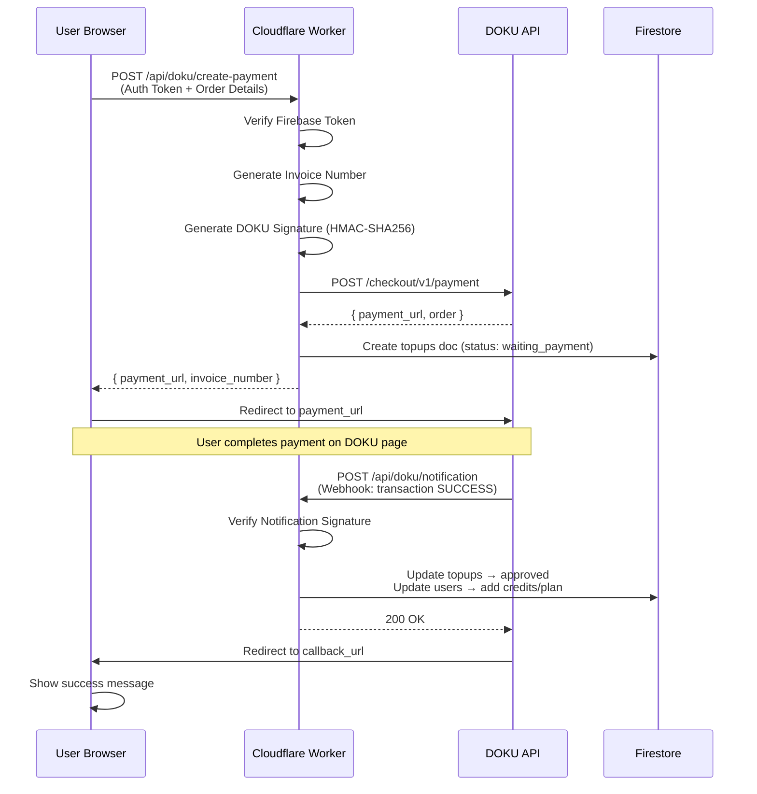

# Integrasi Payment Gateway DOKU ke Halaman Langganan Skripzy

## Background

Saat ini halaman langganan (`/dashboard/langganan`) hanya mendukung **pembayaran manual** — user memilih plan/topup, lalu mengirim request ke Firestore `topups` collection, dan admin harus approve manual. Metode **"Pembayaran Otomatis"** masih bertanda "Coming Soon".

Integrasi DOKU Checkout akan mengaktifkan pembayaran otomatis sehingga user bisa langsung bayar via QRIS, Virtual Account, E-Wallet, Kartu Kredit dll melalui DOKU Checkout Page — tanpa perlu admin approve manual.

### Arsitektur Kunci

- **Next.js Static Export** — Tidak ada API Routes server-side. Semua backend logic harus melalui **Cloudflare Worker** (`script-worker.js`).
- **Cloudflare Worker** — Sudah menangani Gemini proxy, Cloudinary signature, Firestore REST, dll.
- **Firebase Firestore** — Collection `topups` untuk menyimpan billing requests dan `users` untuk data user.

### DOKU API Details

| Item | Value |
|---|---|
| Sandbox URL | `https://api-sandbox.doku.com/checkout/v1/payment` |
| Production URL | `https://api.doku.com/checkout/v1/payment` |
| Client ID | `BRN-0255-1777888777297` |
| Secret Key | `SK-MnZHN1i1ZruKgBNHkLa3` |
| Request Target | `/checkout/v1/payment` |

### DOKU Signature Generation (HMAC-SHA256)

```
1. Digest = Base64(SHA256(requestBodyJSON))
2. SignatureComponents = "Client-Id:{clientId}\nRequest-Id:{requestId}\nRequest-Timestamp:{timestamp}\nRequest-Target:/checkout/v1/payment\nDigest:{digest}"
3. Signature = "HMACSHA256=" + Base64(HMAC-SHA256(secretKey, signatureComponents))
```

---

## User Review Required

> [!IMPORTANT]
> **Kredensial DOKU akan disimpan di Cloudflare Worker environment variables** (bukan di frontend). Secret Key dan Client ID TIDAK akan pernah ter-expose ke browser. Hanya Cloudflare Worker yang akan berkomunikasi langsung dengan API DOKU.

> [!WARNING]
> **Sandbox vs Production**: Saat ini saya akan menggunakan **Sandbox URL** (`api-sandbox.doku.com`) untuk testing. Saat sudah siap live, tinggal ganti environment variable `DOKU_BASE_URL` ke `https://api.doku.com`. Apakah ini OK?

> [!IMPORTANT]
> **DOKU Notification Webhook**: DOKU mengirim notifikasi pembayaran ke URL callback Anda. URL ini harus **publicly accessible**. Cloudflare Worker sudah publicly accessible, jadi endpoint `/api/doku/notification` di worker akan menerima webhook ini. **Anda perlu mengatur Notification URL di DOKU Dashboard** setelah deploy: `https://apikey.skripzy-app.workers.dev/api/doku/notification`

---

## Open Questions

> [!IMPORTANT]
> 1. **Callback URL setelah bayar**: Setelah pembayaran selesai, DOKU redirect user ke mana? Saya akan set default ke `https://skripzy.web.app/dashboard/langganan/?payment=success`. Apakah domain ini benar?
> 2. **Payment expiry time**: Berapa menit batas waktu pembayaran? Default saya set **60 menit** (1 jam). Apakah cukup?
> 3. **Sandbox dulu atau langsung Production?**: Apakah ingin test di Sandbox dulu, atau langsung ke Production URL?

---

## Proposed Changes

### Cloudflare Worker — DOKU Backend Endpoints

#### [MODIFY] [script-worker.js](file:///d:/Projek/Skripzy2/script-worker.js)

Tambah **2 endpoint baru** di Cloudflare Worker:

**1. `POST /api/doku/create-payment`** — Membuat pembayaran DOKU
- Menerima: `{ orderType, itemId, amount, invoiceNumber, customerName, customerEmail, promoCode, priceBreakdown }`
- Memverifikasi Firebase auth token dari header `Authorization: Bearer <idToken>`
- Generate DOKU signature (HMAC-SHA256) menggunakan Web Crypto API
- Panggil `POST https://api-sandbox.doku.com/checkout/v1/payment`
- Simpan record ke Firestore `topups` collection dengan status `"waiting_payment"`
- Return `{ payment_url, invoice_number }` ke frontend

**2. `POST /api/doku/notification`** — Webhook dari DOKU
- Menerima POST dari DOKU saat pembayaran berhasil/gagal
- Verifikasi signature dari header notifikasi
- Jika `transaction.status === "SUCCESS"`:
  - Update Firestore `topups` doc → status `"approved"`
  - Update Firestore `users` doc → tambah credits atau upgrade plan (sama seperti `approveTopup` logic)
- Jika failed → update status `"rejected"`
- Return `200 OK` ke DOKU

**Fungsi helper baru di dalam worker**:
- `generateDokuSignature(clientId, secretKey, requestId, timestamp, requestTarget, bodyJSON)` — Generate HMAC-SHA256 signature
- `verifyDokuNotification(headers, body, clientId, secretKey)` — Verify incoming webhook signature

---

### Cloudflare Worker — Environment Variables

#### [MODIFY] [wrangler.toml](file:///d:/Projek/Skripzy2/wrangler.toml)

Tambah placeholder untuk DOKU secrets (akan di-set di Cloudflare Dashboard):
```
DOKU_CLIENT_ID = "BRN-0255-1777888777297"
DOKU_SECRET_KEY = "SK-MnZHN1i1ZruKgBNHkLa3"  
DOKU_BASE_URL = "https://api-sandbox.doku.com"
```

> [!WARNING]
> `DOKU_SECRET_KEY` sebaiknya di-set via Cloudflare Dashboard sebagai **encrypted secret**, bukan plaintext di `wrangler.toml`. Saya akan menambahkan komentar instruksi di file.

---

### Frontend — Billing Library

#### [MODIFY] [billing.js](file:///d:/Projek/Skripzy2/lib/billing.js)

- Update `PAYMENT_METHODS` → set `automatic` menjadi `enabled: true`, ubah label dan description
- Tambah fungsi `createDokuPayment({ user, selectedItem, promo, priceBreakdown, requestType })` yang memanggil Cloudflare Worker endpoint `/api/doku/create-payment`
- Tambah status baru `"waiting_payment"` untuk flow DOKU

---

### Frontend — Halaman Langganan

#### [MODIFY] [page.js](file:///d:/Projek/Skripzy2/app/dashboard/langganan/page.js)

- Ketika user pilih **"Pembayaran Otomatis"** dan klik checkout:
  - Panggil `createDokuPayment()` → dapatkan `payment_url`
  - Redirect user ke DOKU checkout page via `window.open(payment_url, '_blank')` atau `window.location.href`
- Tambah status `"waiting_payment"` di `STATUS_STYLES` dengan warna biru
- Hilangkan "Coming Soon" notice ketika metode otomatis dipilih
- Tambah handling untuk query param `?payment=success` / `?payment=failed` untuk menampilkan notifikasi setelah redirect balik dari DOKU
- Ketika metode otomatis dipilih, **hide** pilihan channel manual (bank/QRIS/e-wallet manual)

---

### Frontend — Billing Catalog Hook  

#### [MODIFY] [useBillingCatalog.js](file:///d:/Projek/Skripzy2/lib/useBillingCatalog.js)

- Tidak ada perubahan signifikan, hook sudah mendukung realtime listener

---

## Alur Pembayaran Otomatis (End-to-End)



---

## Verification Plan

### Automated Tests
1. **Build test**: `npm run build` — Pastikan static export masih berhasil
2. **Worker deploy test**: `npx wrangler deploy --dry-run` — Pastikan worker syntax valid

### Manual Verification
1. **Buka halaman langganan** → Pilih plan/topup → Pilih "Pembayaran Otomatis" → Klik checkout
2. **Verifikasi redirect** ke DOKU sandbox checkout page
3. **Test sandbox payment** menggunakan DOKU Payment Simulator  
4. **Verifikasi webhook** → Cek Firestore: topups doc berubah status ke "approved", user credits bertambah
5. **Set Notification URL** di DOKU Dashboard: `https://apikey.skripzy-app.workers.dev/api/doku/notification`
