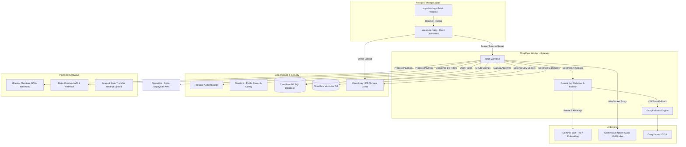

# 🚀 SKRIPZY – BLUEPRINT & ARSITEKTUR FINAL SISTEM

**Skripzy** adalah platform all-in-one berbasis AI (*AI-powered Research Operating System*) yang dirancang untuk membantu mahasiswa dan akademisi mengelola seluruh siklus penelitian—mulai dari curah ide (ideation), penyusunan draf bab, analisis data (kuantitatif & kualitatif), manajemen referensi, simulasi ujian, hingga konversi skripsi menjadi jurnal publikasi.

---

## 🔷 1. DIAGRAM ALIR ARSITEKTUR GLOBAL

Berikut adalah alur komunikasi sistem antara Frontend Next.js, Cloudflare Worker (API Gateway), Database (D1, Vectorize, Firestore), AI Engines, dan Payment Gateway:



---

## 🔷 2. STRUKTUR WORKSPACE & KODE (MONOREPO)

Proyek ini menggunakan struktur monorepo berbasis NPM Workspaces:

*   **`apps/landing`**: Aplikasi Next.js untuk landing page publik. Menyediakan navigasi global, promosi, detail fitur (*Magic Page*), daftar paket harga (*Pricing*), dan tautan unduhan PWA.
*   **`apps/app-main`**: Aplikasi Next.js untuk dashboard utama pengguna. Di sinilah workspace skripsi/jurnal berada.
    *   **`(auth)`**: Autentikasi dengan Firebase.
    *   **`dashboard`**: Mengelola workspace skripsi, jurnal, alat parafrase, humanizer, detector AI, dan pengaturan langganan.
    *   **`admin`**: Halaman pemantauan sistem, kredit, harga, dan analitik penggunaan API.
*   **`lib/`**: Utilitas bersama yang digunakan oleh frontend:
    *   `d1Client.js`: Klien CRUD database D1 yang membungkus token Firebase.
    *   `ragService.js`: Mesin RAG (Chunking, Embedding, Vector Search, Summary).
    *   `geminiLiveClient.js`: Koneksi WebSocket untuk obrolan suara real-time (*Chat Dosen AI*).
    *   `billing.js`: Logika perhitungan harga, promo, diskon durasi, dan checkout iPaymu/DOKU.
    *   `pwaUtils.js`: Utilitas PWA untuk offline caching, IndexedDB, dan notifikasi.
*   **`script-worker.js`**: Kode sumber Cloudflare Worker yang berfungsi sebagai backend API gateway mandiri.
*   **`wrangler.toml`**: Konfigurasi deployment Cloudflare Worker yang mengikat database D1 (`DB`) dan Vectorize (`VECTOR_INDEX`).

---

## 🔷 3. BLUEPRINT BACKEND: CLOUDFLARE WORKER (`script-worker.js`)

Cloudflare Worker bertindak sebagai pintu gerbang (*API Gateway*) yang mengamankan seluruh transaksi data.

### A. Gemini Balancer & Rotation System
Untuk menghindari batas kuota gratis (*rate limit* 429), Worker mengimplementasikan rotasi kunci API cerdas:
1.  **Grup Kunci**: 8 kunci API Gemini disimpan dalam 4 grup (`group_1` s.d `group_4`) di Environment Variables.
2.  **Rate Limiting Lokal**: Mengecek penggunaan harian per model di tabel `api_usage` sebelum mengirim request. Batas harian di-reset tengah malam waktu PT (Pacific Time).
3.  **Fallback ke Groq**: Jika Gemini mengembalikan error rate limit (429), otorisasi, atau wilayah yang tidak didukung, sistem secara otomatis mengalihkan request ke **Groq API** menggunakan model `llama-3.3-70b-versatile` atau `llama-4-scout` secara mulus tanpa disadari pengguna.
4.  **WebSocket Proxy**: Menyediakan rute `/ws/gemini-live` untuk menjembatani browser dengan model `gemini-2.5-flash-native-audio-preview-12-2025` untuk fitur panggilan suara interaktif.

### B. Cloudflare D1 CRUD API
Menggantikan integrasi DB tradisional dengan API dinamis `/api/d1/:table`.
*   Semua kueri CRUD secara otomatis divalidasi menggunakan token Firebase (`session.uid`).
*   Pengguna biasa hanya dapat mengakses data milik mereka sendiri (`WHERE user_id = uid`), sementara pengguna bertipe `admin` dapat membaca seluruh isi tabel.

### C. Academic Search Reference APIs
Menyediakan integrasi langsung dengan mesin pencari jurnal global:
*   **OpenAlex API**: Pencarian jurnal akademis terfilter berdasarkan tanggal publikasi dan diurutkan secara relevan.
*   **Core API**: Pencarian works/jurnal menggunakan kata kunci.
*   **Unpaywall API**: Menemukan versi PDF open-access dari artikel jurnal ilmiah.

---

## 🔷 4. SISTEM MONETISASI & PEMBAYARAN (*BILLING STUDIO*)

Sistem monetisasi menggunakan model hibrida: **Langganan Bulanan/Tahunan** (untuk fitur/kecepatan) + **Kredit Token** (untuk konsumsi AI).

### A. Subscription Plans
*   **Free Plan** (Rp 0): 20 kredit awal, akses alat dasar (Parafrase & Grammar), batas input 2k karakter.
*   **Pro Plan** (Rp 49.000/bulan): 500 kredit/bulan, batas input 5k karakter, akses semua alat premium (Humanizer, AI Detector, Simulasi Sidang).
*   **Plus Plan** (Rp 99.000/bulan): 1000 kredit/bulan, batas input 8k karakter, performa server prioritas.

*Catatan: Pembelian multi-bulan mendapatkan diskon berjenjang (3 Bulan = 5%, 6 Bulan = 10%, 12 Bulan = 20%).*

### B. Kredit & Harga Fitur
Setiap fitur AI mengonsumsi kredit dari akun pengguna:
*   Generasi bab skripsi/jurnal: 2 kredit
*   Asisten AI (Latar belakang): 3 kredit
*   Simulasi Sidang: 5 kredit
*   Panggilan Suara Dosen AI: 3 kredit
*   Parafrase / Cek Grammar: 2 kredit

### C. Alur Checkout Pembayaran
1.  **Otomatis (iPaymu / DOKU)**:
    *   Frontend meminta pembuatan pembayaran via `/api/ipaymu/create-payment` atau `/api/doku/create-payment`.
    *   Worker membuat invoice, mencatat status `waiting_payment` di tabel `topups` D1, dan mengembalikan `payment_url` (QRIS, VA, E-Wallet).
    *   Setelah pengguna membayar, gateway mengirimkan notifikasi ke webhook `/api/ipaymu/notification`.
    *   Worker memverifikasi tanda tangan transaksi, mengubah status topup menjadi `approved`, lalu memperbarui kredit/plan user di tabel `users` D1 secara instan via fungsi `applyApprovedBilling`.
2.  **Manual**:
    *   Pengguna mentransfer ke rekening Bank (BRI, SeaBank, BNI) atau E-Wallet (GoPay, DANA, ShopeePay).
    *   Pengguna mengunggah bukti transfer (`proofImageUrl`) ke dashboard.
    *   Kredit/plan diperbarui secara manual setelah diverifikasi oleh admin.

---

## 🔷 5. BLUEPRINT RAG: "SUMMARY-FIRST" REFERENCE INTELLIGENCE

Akurasi sitasi dan referensi dikelola oleh arsitektur RAG yang dioptimalkan untuk performa tinggi:

```
[Upload PDF/Doc] ──> [Text Extraction] ──┬─> [Gemini-Flash-Lite] ──> [AI Document Summary] ──> [D1 Storage]
                                         │
                                         └─> [Chunking & Embedding] ──> [Cloudflare Vectorize]
```

### A. Alur Unggah & Indexing (`ragService.js`)
1.  **AI Document Summary (Guaranteed Context)**: Saat dokumen diunggah, teks 5000 karakter pertama dikirim ke model `gemini-flash-lite-latest` dengan perintah untuk memformat keluaran menjadi JSON terstruktur (Judul, Penulis, Tahun, Abstrak, Metode, Temuan Utama, Kata Kunci). Ringkasan ini disimpan di D1 dan **selalu disisipkan sebagai konteks utama** AI tanpa perlu dicari lewat vektor. Hal ini mencegah halusinasi data dokumen.
2.  **Chunking**: Teks penuh dipecah menjadi potongan-potongan sebesar 2000 karakter dengan tumpang tindih (*overlap*) 200 karakter, dibatasi maksimal 25 potongan.
3.  **Embedding**: Potongan teks diubah menjadi vektor 768 dimensi menggunakan model `gemini-embedding-2` melalui batch API.
4.  **Vector Store**: Vektor di-upsert ke *Cloudflare Vectorize* lengkap dengan metadata (user_id, workspace_id, document_id, nomor halaman, dan konten teks asli).

### B. Adaptive Retrieval (Pencarian Pintar)
Saat pengguna mengajukan pertanyaan di dalam workspace referensi:
1.  Kueri diubah menjadi embedding.
2.  Sistem melakukan pencarian kemiripan kosinus (*cosine similarity*) ke Cloudflare Vectorize.
3.  **Adaptive Threshold**:
    *   Sistem menyaring hasil secara ketat dengan ambang kemiripan minimal **0.35**.
    *   Jika potongan yang relevan kurang dari 2, sistem secara otomatis melonggarkan batas ambang kemiripan menjadi **0.2** untuk memastikan pengguna tetap mendapatkan konteks pendukung yang cukup.

---

## 🔷 6. BLUEPRINT DATABASE: SKEMA D1 SQL (`schema.sql`)

Skripzy mengandalkan database SQL relasional Cloudflare D1 untuk data terstruktur:

1.  **`users`**: Data profil pengguna, jumlah `credits`, status `plan` (free/pro/plus), peran (`role` user/admin), institusi, dan foto profil.
2.  **`workspaces`**: Workspace pengerjaan penelitian. Berisi teks mentah per bab (`bab1` sampai `bab6`), jenis penelitian (`kuantitatif`/`kualitatif`), progres penulisan (0-100%), dan status draft.
3.  **`document_metadata`**: Informasi jurnal akademis yang diunggah oleh pengguna, mencakup judul, penulis, tahun terbit, tautan PDF Cloudinary, dan kolom teks `summary` hasil AI.
4.  **`notebooks`**: Catatan independen di luar workspace utama.
5.  **`topups`**: Riwayat transaksi, mencatat detail invoice, kanal pembayaran, nilai diskon promo, data respons mentah dari DOKU/iPaymu, serta tautan unggahan bukti transfer manual.
6.  **`promos`**: Pengelolaan kode kupon diskon (tipe persentase/potongan tetap, tanggal kedaluwarsa, batas penggunaan).
7.  **`pricing`**: Katalog produk langganan, top-up kredit, dan biaya penggunaan kredit masing-masing fitur AI.
8.  **`api_usage`**: Catatan analitik penggunaan kunci API Gemini, mencatat nama kunci API, nama model, jumlah token, dan waktu request untuk pemantauan rate limit harian.

---

## 🔷 7. PROGRESSIVE WEB APP (PWA) & DUKUNGAN OFFLINE

Aplikasi dirancang agar dapat diinstal di perangkat seluler dan komputer desktop layaknya aplikasi lokal (*native-like experience*):

*   **Service Worker (`sw.js`)**:
    *   **Network First**: Digunakan untuk halaman dinamis seperti dashboard agar selalu menampilkan data paling mutakhir saat online.
    *   **Cache First**: Digunakan untuk berkas aset statis (CSS, JS, Fonts, Images) dengan masa berlaku hingga 30 hari untuk mempercepat waktu pemuatan halaman.
    *   **Stale While Revalidate**: Digunakan untuk respon API (Firebase/Gemini) agar respon dimuat instan dari cache sementara update dilakukan di latar belakang.
*   **Offline Fallback Page (`offline.html`)**: Halaman khusus yang akan muncul secara otomatis ketika pengguna kehilangan koneksi internet saat menavigasi bagian aplikasi yang belum ter-cache.
*   **IndexedDB Sync**: Menggunakan IndexedDB lokal (`indexedDBUtils`) untuk mencatat rancangan penulisan (drafts/notes) secara lokal saat offline. Data tersebut akan secara otomatis disinkronisasikan ke database cloud (Firestore/D1) saat perangkat terhubung kembali ke internet.

---

## 🔷 8. ALUR KERJA UTAMA PENGGUNA (*USER FLOW*)

```
[Pendaftaran/Login via Google] 
             ↓
[Buat Workspace (Skripsi/Jurnal)] ──> [Tentukan Topik & Metodologi]
             ↓
[Unggah Dokumen Referensi] ──> [AI Mengekstrak Metadata & Summary Otomatis]
             ↓
[Mulai Menulis di Smart Canvas] ──> [Gunakan AI untuk Menulis Bab 1-5 / Parafrase / Cek Grammar]
             ↓
[Data Analisis (Kuesioner/Transkrip)] ──> [Interpretasi Data Otomatis]
             ↓
[Simulasi Sidang Akademik] ──> [Siap Ujian & Konversi Skripsi ke Jurnal]
```

---

## 🔷 9. FITUR UTAMA & MEKANISME KERJA (PERSPEKTIF PENGGUNA)

Berikut adalah daftar fitur utama Skripzy beserta mekanisme penggunaannya yang dirancang sederhana dan ramah bagi mahasiswa:

### 1. 📝 Workspace Cerdas (Smart Canvas)
*   **Bagaimana cara kerjanya?**
    Pengguna menulis draf penelitian di lembar kerja interaktif yang mirip dengan aplikasi catatan modern (seperti Notion). 
*   **Mekanisme AI**:
    *   **Perintah Slash (/)**: Cukup mengetik tanda miring `/` di papan ketik (misalnya `/generate bab 1` atau `/rumusan masalah`), AI akan langsung menyusun tulisan akademis terstruktur di posisi kursor tersebut.
    *   **Inline Editing**: Blok kalimat yang dirasa kurang pas, lalu klik tombol bantuan untuk meminta AI menulis ulang, memperpanjang, memperpendek, atau menyempurnakan tata bahasanya secara instan.

### 2. 📚 Referensi Cerdas (Reference Intelligence)
*   **Bagaimana cara kerjanya?**
    Membantu mengelola tumpukan jurnal referensi dan buku digital tanpa membuat pengguna pusing membacanya satu per satu dari awal.
*   **Mekanisme AI**:
    *   **Ringkasan Otomatis**: Saat PDF diunggah, AI langsung membuat rangkuman ringkas berisi: Judul, Penulis, Tahun, Abstrak, Metode yang dipakai, serta Temuan Utama dokumen.
    *   **Tanya Jawab Dokumen**: Pengguna bisa mengetik pertanyaan seputar isi dokumen (misal: *"Apa teori utama yang dipakai di jurnal ini?"*). AI akan mencarikan potongan paragraf yang paling relevan lengkap dengan nomor halaman aslinya untuk akurasi sitasi.

### 3. 🎙️ Chat Dosen AI (Asisten Suara Pembimbing)
*   **Bagaimana cara kerjanya?**
    Fitur konsultasi interaktif di mana pengguna bisa mengobrol santai mengenai topik riset mereka dengan AI yang berperan sebagai dosen pembimbing akademis.
*   **Mekanisme AI**:
    *   **Panggilan Suara Real-time**: Pengguna cukup menekan tombol telepon dan berbicara menggunakan mikrofon. Dosen AI akan langsung menjawab secara verbal dengan suara manusia yang hangat dan natural.
    *   **Deteksi Selaan (Barge-in)**: Jika dosen sedang menjelaskan lalu pengguna memotong pembicaraannya, AI akan langsung berhenti bersuara dan mulai mendengarkan kembali masukan baru dari pengguna.

### 4. 📊 Mesin Metodologi (Data Analysis Engine)
*   **Bagaimana cara kerjanya?**
    Mengotomatiskan pengolahan data penelitian kuantitatif maupun kualitatif agar mahasiswa tidak terjebak dalam rumus-rumus rumit.
*   **Mekanisme AI**:
    *   **Kuantitatif (Uji Statistik)**: Pengguna membuat kuesioner di platform dan menyebarkan link ke responden. Setelah terkumpul, sistem menjalankan uji validitas, reliabilitas, dan regresi, kemudian langsung menyusun analisis deskriptifnya dalam bahasa Indonesia siap pakai untuk Bab 4.
    *   **Kualitatif (Transkrip Wawancara)**: Pengguna mengunggah rekaman suara wawancara. Sistem akan mengubahnya menjadi teks (transkrip), menandai kutipan-kutipan penting berdasarkan tema, dan menyusun narasi hasil penelitian secara teratur.

### 5. 🧑‍⚖️ Simulasi Sidang Akademik (Defense Simulator)
*   **Bagaimana cara kerjanya?**
    Gladi resik atau latihan presentasi ujian skripsi/tesis sebelum hari-H untuk melatih kesiapan mental dan penguasaan materi.
*   **Mekanisme AI**:
    *   **Penguji Galak**: AI akan membaca draf bab yang telah ditulis pengguna dan melontarkan pertanyaan-pertanyaan kritis yang biasa ditanyakan oleh penguji sidang asli.
    *   **Lembar Penilaian**: Setelah simulasi, pengguna diberikan skor, daftar kelemahan argumen mereka, serta rekomendasi cara menjawab yang baik untuk setiap pertanyaan sulit.

### 6. 🛠️ Alat Bantu Cepat (Quick Tools)
Fitur-fitur mandiri yang dapat diakses secara cepat kapan saja oleh pengguna untuk memoles draf tulisan atau mencari referensi pendukung secara instan.

*   **A. Asisten AI (Generator Judul & Latar Belakang)**
    *   *Bagaimana cara kerjanya?* Membantu memikirkan judul penelitian yang menarik dan memiliki unsur kebaruan (*novelty*), serta membantu menyusun draf latar belakang masalah dari nol.
    *   *Mekanisme AI*: Sistem memindai artikel ilmiah global secara real-time, memetakan celah penelitian (*research gap*) yang belum banyak diteliti, dan mengusulkan judul lengkap dengan rumusan masalah yang siap disalin. Untuk latar belakang, AI menyusun 6-7 paragraf terstruktur deduktif (dari teori umum hingga urgensi khusus) yang diperkuat dengan rujukan jurnal nyata.
*   **B. Parafrase Cerdas**
    *   *Bagaimana cara kerjanya?* Menulis ulang kalimat atau paragraf agar terhindar dari deteksi plagiasi (seperti skor tinggi pada Turnitin) tanpa merusak arti ilmiah dari kalimat aslinya.
    *   *Mekanisme AI*: AI membedah makna kalimat lama, mencari padanan kata akademis yang sesuai, dan menyusunnya kembali dengan struktur kalimat yang baru secara otomatis.
*   **C. Cek Grammar (Tata Bahasa & Ejaan)**
    *   *Bagaimana cara kerjanya?* Mendeteksi dan memperbaiki salah ketik (*typo*), kata-kata tidak baku, dan kalimat tidak efektif agar tulisan sesuai dengan kaidah PUEBI/KBBI.
    *   *Mekanisme AI*: AI menyaring teks, mengidentifikasi ketidaksesuaian struktur kalimat (Subjek-Predikat-Objek), dan memberikan saran perbaikan ejaan secara instan.
*   **D. Humanizer (Penghalus Tulisan)**
    *   *Bagaimana cara kerjanya?* Mengubah teks hasil buatan AI yang kaku, monoton, dan terdeteksi robotik menjadi tulisan ilmiah yang luwes, natural, dan ramah dibaca layaknya ditulis oleh manusia.
    *   *Mekanisme AI*: AI merestrukturisasi variasi panjang-pendek kalimat, menyisipkan transisi paragraf yang lebih halus, serta memodifikasi pola kosakata agar terbebas dari ciri khas tulisan mesin.
*   **E. AI Detector**
    *   *Bagaimana cara kerjanya?* Memindai teks tulisan untuk mengukur seberapa besar persentase indikasi bahwa dokumen tersebut ditulis menggunakan teknologi AI.
    *   *Mekanisme AI*: AI menganalisis tingkat keterdugaan kata (*perplexity*) dan variasi pola penulisan (*burstiness*) di dalam draf teks untuk memberikan prediksi akurat.
*   **F. Referensi & Sitasi Instan**
    *   *Bagaimana cara kerjanya?* Mencari jurnal akademis terpercaya dan secara otomatis membuat format rujukan/daftar pustaka.
    *   *Mekanisme AI*: Menghubungkan kata kunci pencarian pengguna ke basis data jurnal global, menyajikan dokumen pendukung yang valid, dan menyusun sitasi dalam berbagai format standar (seperti APA, MLA, atau Harvard) sekali klik.

### 7. 🔄 Konversi Skripsi ke Jurnal
*   **Bagaimana cara kerjanya?**
    Merangkum dokumen skripsi/tesis yang tebalnya ratusan halaman menjadi artikel jurnal ringkas berukuran 10-15 halaman.
*   **Mekanisme AI**:
    *   Pengguna mengunggah template jurnal ilmiah yang dituju. AI akan memandu proses ekstraksi data bab-per-bab dan menyesuaikan format tulisan agar sesuai dengan panduan penulisan (*author guidelines*) jurnal target.

---

Blueprint arsitektur ini memastikan Skripzy beroperasi secara efisien, hemat biaya (melalui load balancer Gemini dan database serverless D1/Vectorize), tahan terhadap kegagalan jaringan (melalui PWA offline sync), dan siap diskalakan untuk melayani ribuan mahasiswa secara bersamaan.

